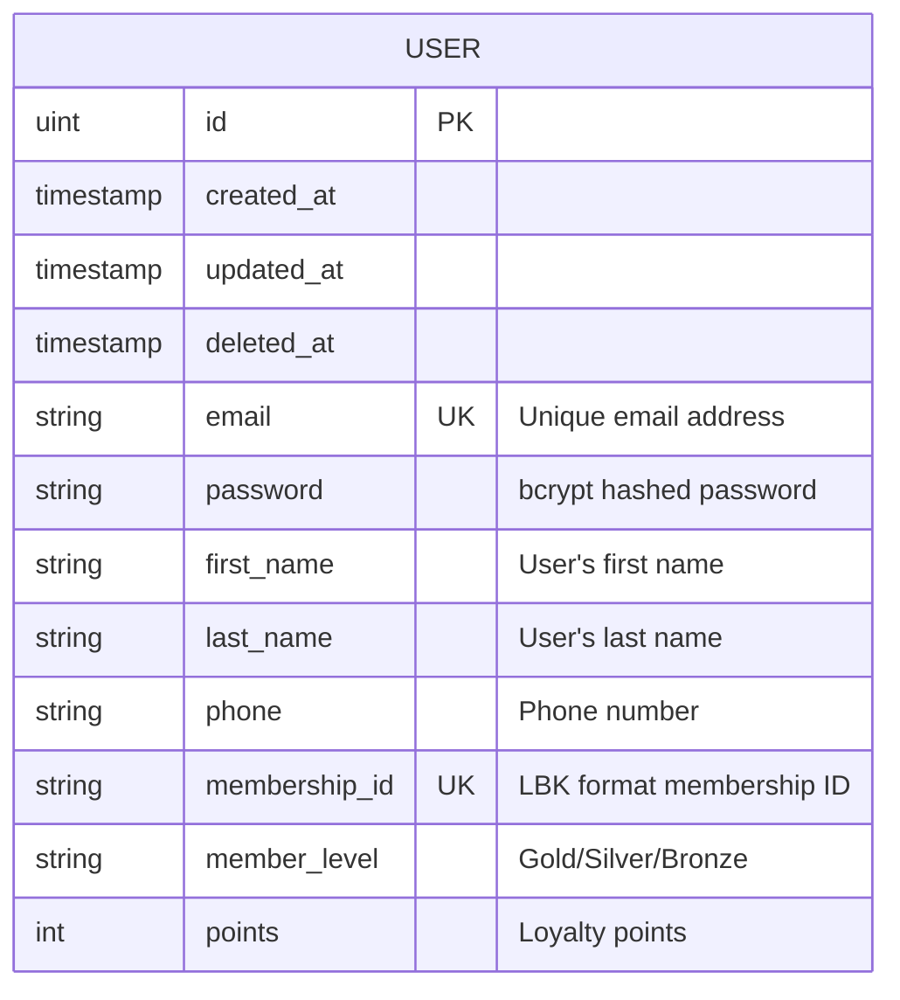
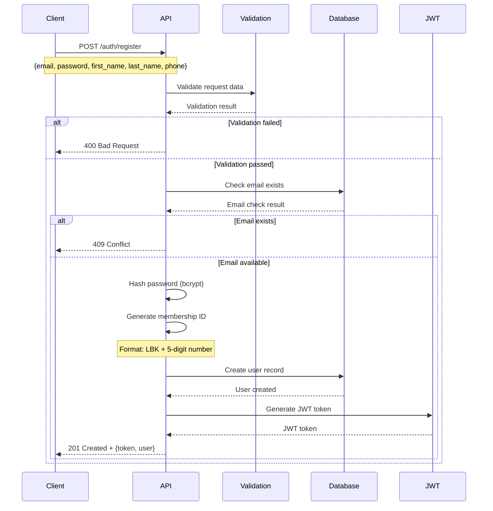
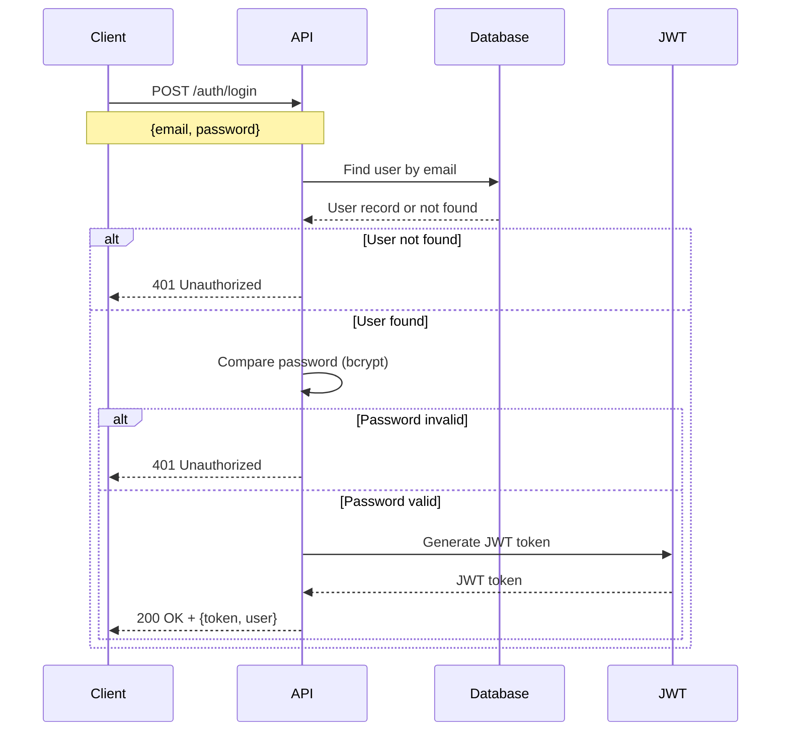
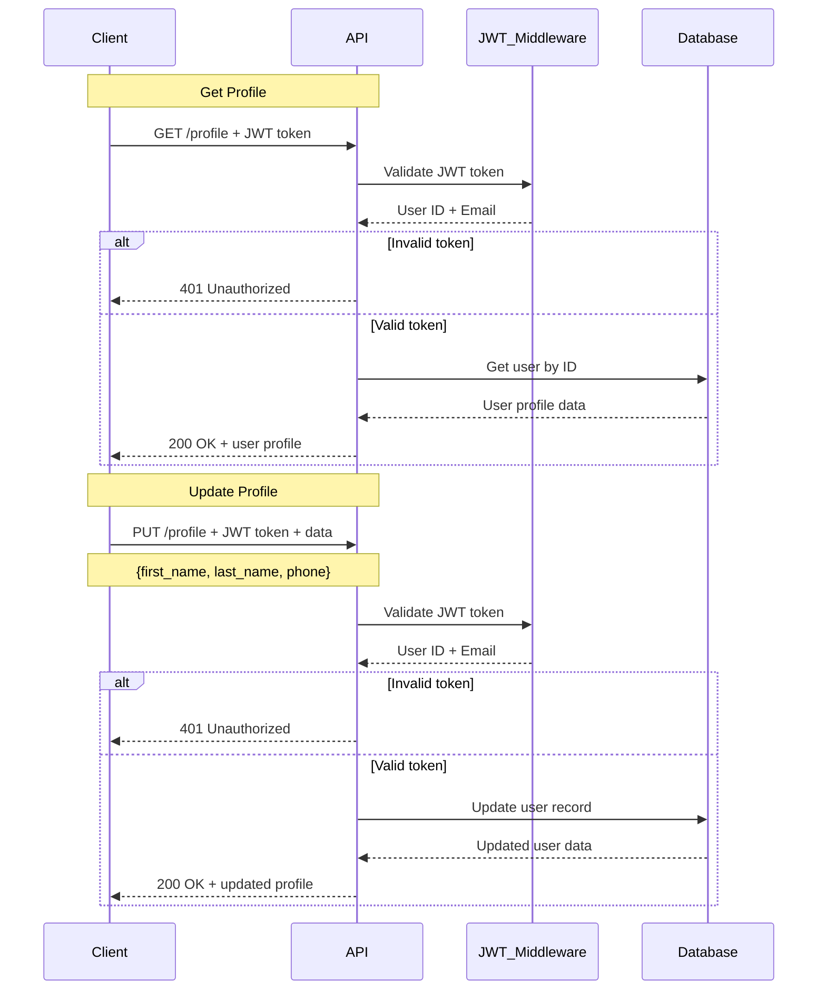
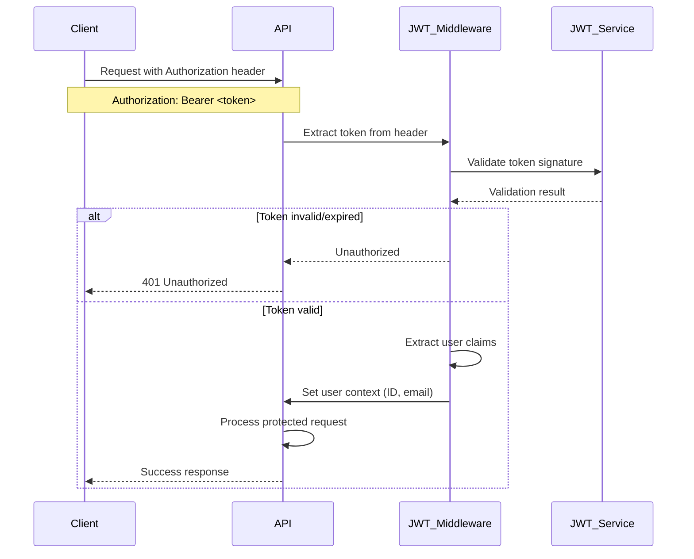

# Training KBTG Backend API - Technical Documentation

## Overview
This document provides technical details about the Training KBTG Backend API including system architecture, database design, and API workflows.

## System Architecture

### Technology Stack
- **Backend Framework:** Go Fiber v2.52.9
- **Database:** SQLite with GORM ORM
- **Authentication:** JWT (JSON Web Tokens)
- **Password Hashing:** bcrypt
- **API Documentation:** Swagger/OpenAPI
- **Development:** Go 1.21+

## Database Design

### Entity Relationship Diagram



### Database Schema Details

#### Users Table
| Field | Type | Constraints | Description |
|-------|------|-------------|-------------|
| id | INTEGER | PRIMARY KEY, AUTOINCREMENT | Unique user identifier |
| created_at | DATETIME | NOT NULL | Registration timestamp |
| updated_at | DATETIME | NOT NULL | Last update timestamp |
| deleted_at | DATETIME | NULL, INDEXED | Soft delete timestamp |
| email | TEXT | UNIQUE, NOT NULL | User email address |
| password | TEXT | NOT NULL | bcrypt hashed password |
| first_name | TEXT | NULL | User's first name |
| last_name | TEXT | NULL | User's last name |
| phone | TEXT | NULL | User's phone number |
| membership_id | TEXT | UNIQUE | Auto-generated LBK format ID |
| member_level | TEXT | DEFAULT 'Gold' | Membership tier |
| points | INTEGER | DEFAULT 0 | Loyalty points balance |

## API Workflows

### User Registration Flow



### User Login Flow



### Profile Management Flow



### JWT Authentication Flow



## API Endpoints Summary

### Authentication Endpoints
- `POST /auth/register` - User registration with profile data
- `POST /auth/login` - User authentication and token generation

### Profile Management Endpoints
- `GET /profile` - Retrieve current user profile
- `PUT /profile` - Update user profile information
- `GET /profile/membership` - Get membership details and points

### General Endpoints
- `GET /` - Health check endpoint
- `GET /protected` - Example protected route
- `GET /swagger/*` - API documentation

## Security Features

### Password Security
- Passwords are hashed using bcrypt with default cost (10)
- Original passwords are never stored in the database
- Password validation requires minimum 6 characters

### JWT Security
- Tokens expire after 24 hours
- Tokens include user ID and email claims
- Secret key used for signing (should be environment variable in production)

### API Security
- CORS enabled for cross-origin requests
- Request logging middleware for audit trails
- Protected routes require valid JWT tokens

## Error Handling

### HTTP Status Codes
- `200 OK` - Successful GET/PUT requests
- `201 Created` - Successful user registration
- `400 Bad Request` - Invalid request data
- `401 Unauthorized` - Missing or invalid authentication
- `404 Not Found` - User not found
- `409 Conflict` - Email already exists during registration
- `500 Internal Server Error` - Server-side errors

### Error Response Format
```json
{
  "error": "Error message description"
}
```

## Data Formats

### User Registration Request
```json
{
  "email": "user@example.com",
  "password": "123456",
  "first_name": "John",
  "last_name": "Doe",
  "phone": "081-234-5678"
}
```

### Authentication Response
```json
{
  "token": "eyJhbGciOiJIUzI1NiIsInR5cCI6IkpXVCJ9...",
  "user": {
    "id": 1,
    "created_at": "2025-09-18T14:35:51.432837+07:00",
    "updated_at": "2025-09-18T14:35:51.432837+07:00",
    "email": "user@example.com",
    "first_name": "John",
    "last_name": "Doe",
    "phone": "081-234-5678",
    "membership_id": "LBK80951",
    "member_level": "Gold",
    "points": 0
  }
}
```

### Membership Information Response
```json
{
  "membership_id": "LBK80951",
  "member_level": "Gold",
  "points": 0,
  "member_since": "18/9/2025",
  "full_name": "John Doe",
  "email": "user@example.com",
  "phone": "081-234-5678"
}
```

## Deployment Considerations

### Environment Variables
- `JWT_SECRET` - Secret key for JWT signing
- `DB_PATH` - SQLite database file path
- `PORT` - Server port (default: 3000)

### Production Recommendations
1. Use strong JWT secret key
2. Enable HTTPS/TLS
3. Implement rate limiting
4. Use production-grade database (PostgreSQL/MySQL)
5. Add comprehensive logging and monitoring
6. Implement backup strategies
7. Add input sanitization and validation
8. Use environment-based configuration

## Future Enhancements
- Points transaction system
- Membership level upgrade logic
- Password reset functionality
- Email verification system
- Role-based access control (RBAC)
- API rate limiting
- Comprehensive audit logging
